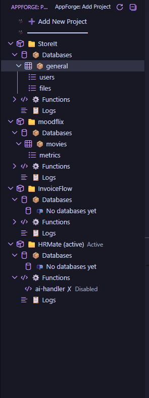
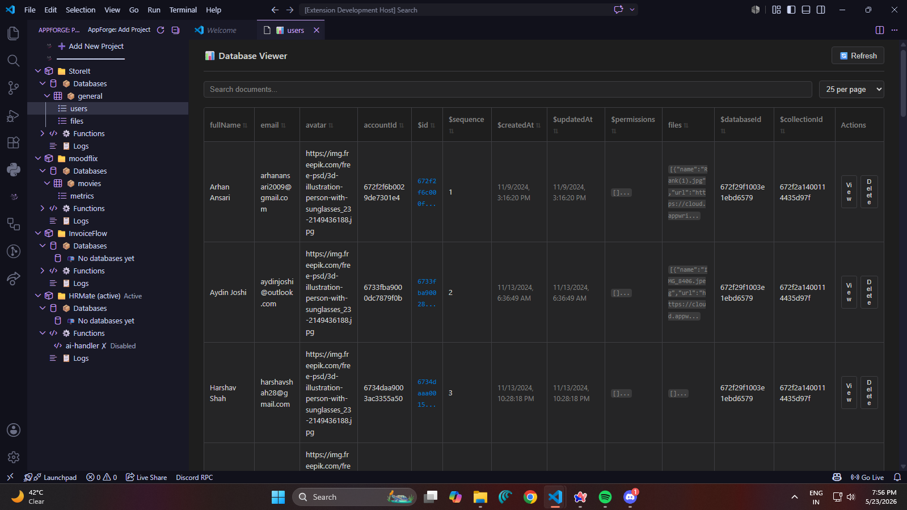
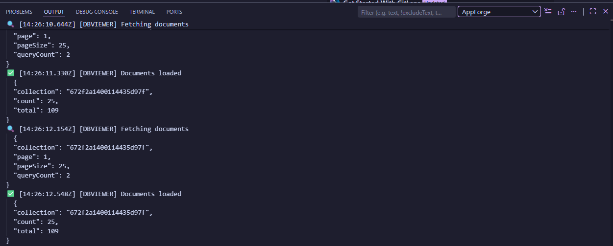
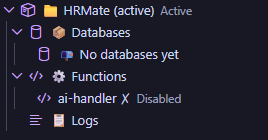

# AppForge

Appwrite-native developer tooling inside VS Code.

[](./CHANGELOG.md)
[](./CHANGELOG.md)
[](https://code.visualstudio.com/api)
[](./tsconfig.json)
[](https://appwrite.io)
[](#license)

AppForge is a VS Code extension for Appwrite developers who need multi-project backend workflows without leaving the editor. It combines project management, a TreeView resource explorer, diagnostics, structured logging, and secure credential storage into a single developer cockpit.

## Overview

AppForge removes the friction of bouncing between VS Code and the Appwrite console for everyday backend tasks. It is designed for developers who manage multiple Appwrite projects, need fast context switching, and want reliable visibility into what the extension is doing when data looks wrong.

It solves the problems that usually show up in real Appwrite workflows:

- Switching between tools just to inspect projects, databases, or functions
- Losing confidence in backend state when async refreshes race each other
- Debugging empty or inconsistent results without enough logging
- Managing multiple projects with unsafe shared client state
- Repeating setup work every time you return to the console

## Core Features

### Multi-Project Management

- Store multiple Appwrite projects securely in VS Code workspace state and SecretStorage
- Add, remove, and switch projects from the sidebar or command palette
- Keep project metadata isolated by project ID
- Auto-load the active project on extension activation
- Status bar indicator for quick project identification

### Database Explorer

- Hierarchical tree view of databases, collections, and documents
- Lazy-load documents for responsive navigation (first 100 documents)
- Inspect collection attributes with field types
- View indexes and their configurations
- Create, update, and delete documents directly
- Collection schema browser with attribute details

### Functions Explorer

- Browse all functions per project
- View deployment metadata and configurations
- Inspect function variables and settings
- Execute functions directly from the sidebar
- Deploy new function versions without leaving VS Code
- Execution history and status tracking

### Storage Explorer

- Browse buckets and file contents per project
- View bucket permissions and metadata
- Inspect file details and sizes
- Upload and delete files from the UI
- File management through context menus
- Bucket-level access control inspection

### TreeView Resource Explorer

- Unified sidebar explorer for all Appwrite resources
- Expand resources lazily for responsive navigation
- Preserve expansion state across refreshes
- Use context menus for quick actions on all resource types
- Color-coded tree items for resource types

### Logs Viewer

- Centralized WebView panel for operation logs
- Raw REST and SDK response inspection
- Structured logging with success/warning/error/debug levels
- Timing information for async operations
- Diagnostic traces for troubleshooting
- Export logs for support workflows

### Appwrite Integration

- Connect to Appwrite Cloud or self-hosted Appwrite instances
- Use Appwrite API keys for backend operations
- Validate connections before saving a project
- Run database, function, and storage workflows from within VS Code
- Support for multiple Appwrite versions

### Project Switching

- Switch context instantly from the sidebar or status bar
- Avoid manual reconfiguration when moving between environments
- Keep each project node independent and deterministic
- Reduce stale state during fast project changes
- Status bar shows active project name

### Diagnostics System

- Inspect stored project metadata and connection details
- Compare SDK responses with raw REST responses
- Troubleshoot empty database results with dedicated tooling
- Verify project and endpoint identity before chasing UI bugs
- Comprehensive runtime logging with console traces

### Logging System

- Structured runtime logging through the Output Channel
- Success, warning, error, and debug events
- Timing-aware logging for async operations
- Diagnostics output designed for real support workflows
- Diagnostic traces for proof of execution: `[TREE]`, `[DATABASES]`, `[STATUSBAR]`, etc.

### Developer-Focused UX

- Validation-rich setup forms
- Loading indicators for long-running operations
- Confirmation dialogs for destructive actions
- Command palette integration for all major workflows
- Clear status feedback for project and backend actions

### Type-Safe Architecture

- Written in strict TypeScript
- Uses Zod for configuration and input validation
- Built on VS Code extension APIs with explicit service boundaries
- Keeps project state, backend state, and UI state separated

### Command Palette Integration

- `AppForge: Add Project`
- `AppForge: Remove Project`
- `AppForge: Switch Project`
- `AppForge: Refresh Projects`
- `AppForge: Refresh Databases`
- `AppForge: Refresh Functions`
- `AppForge: Refresh Storage`
- `AppForge: Create Collection`
- `AppForge: Create Document`
- `AppForge: Delete Document`
- `AppForge: List Documents`
- `AppForge: Update Document`
- `AppForge: Execute Function`
- `AppForge: Deploy Function`
- `AppForge: View Logs`
- `AppForge: View Function Logs`
- `AppForge: Check Project Status`
- `AppForge: View Connection Info`
- `AppForge: Troubleshoot Empty Databases`
- `AppForge: Verify Appwrite Project Environment`
- `AppForge: Run Diagnostics`

## ✨ What's New in v0.2.0-alpha

v0.2.0-alpha introduces comprehensive resource explorers for Databases, Functions, and Storage, plus improved diagnostic tooling.

### Database Explorer

- View all databases and collections in a hierarchical tree
- Browse collection attributes, indexes, and documents
- Lazy-load documents (first 100) for responsive navigation
- Inspect document structure and field types
- Create, delete, and update documents directly from the explorer
- Collection schema with attribute types and index details
- Right-click context menus for common operations

### Functions Explorer

- Browse all functions and their deployments per project
- View deployment metadata and execution history
- Display function variables and configuration
- Execute functions directly from the sidebar
- Deploy new function versions without leaving VS Code
- Monitor function status and metadata

### Storage Explorer

- Browse buckets and their contents
- View bucket permissions and configuration
- Inspect file metadata and sizes
- Upload and delete files from the UI
- File management operations from context menus
- Bucket-level access controls

### Logs Viewer

- Centralized logging panel for operation traces
- View raw REST and SDK responses
- Structured logging with success/warning/error levels
- Timing information for async operations
- Diagnostic tooling for database verification
- Export logs for support workflows

### Status Bar Enhancement

- Active project indicator in VS Code status bar
- LEFT alignment with priority 1000 for visibility
- Quick project switching from the status bar
- Real-time project name display
- Click-to-switch project workflow

### Improved Diagnostics

- Comprehensive project metadata inspection
- Raw REST vs SDK response comparison
- Endpoint and project ID verification
- Runtime logging with diagnostic traces
- Proof of execution through console logs
- API call tracing for database operations

**Experimental Features**:

- Logs Viewer is a preview feature with roadmap updates in v0.2.1-alpha
- Function deployment via drag-and-drop (upcoming)
- Real-time document change notifications (upcoming)

This release focuses on making Appwrite resources fully visible and queryable from VS Code, with transparent logging to build confidence in multi-project workflows.

## Architecture

AppForge is organized around explicit boundaries so project context never depends on hidden global state.

### Project-Scoped Services

Each Appwrite operation is created from project-specific inputs rather than a long-lived mutable client. That keeps database, function, and diagnostic calls tied to the project being acted on.

### Appwrite Client Lifecycle

The client layer now acts as a factory for isolated SDK instances. Services are created per project and per operation, then discarded after use. That removes cross-project contamination and async race conditions caused by shared state.

### Extension Structure

- `src/extension.ts` wires activation, services, and command registration
- `src/providers/treeDataProvider.ts` owns the sidebar resource explorer
- `src/commands/` contains project, database, function, and diagnostics workflows
- `src/views/` contains webviews and resource panels
- `src/services/` contains storage and Appwrite client factories
- `src/core/` contains refresh orchestration, events, and output logging
- `src/types/` contains shared type definitions
- `src/utils/` contains validation and parsing helpers

### Diagnostics Flow

Diagnostics are designed to answer a simple question quickly: is the problem local, configuration-related, or remote?

The current flow captures:

- Stored project metadata from workspace state
- Redacted API key context
- Endpoint and project ID identity
- SDK response payloads
- Raw REST response payloads

### Command System

Commands are exposed through the command palette and sidebar interactions. Each command resolves project context explicitly before creating its Appwrite service, which keeps behavior deterministic even when multiple projects are open or switching quickly.

## Screenshots

> Replace these placeholders with real captures before publishing.

### Project Explorer



### Database Tree



### Diagnostics Logs



### Project Switching



## Installation

### From Source

```bash
git clone https://github.com/ArhanAnsari/appforge.git
cd appforge
npm install
npm run build
```

### Run the Extension Host

```bash
npm run watch
```

Then press `F5` in VS Code to launch the Extension Development Host.

## Development

### Common Commands

```bash
npm run check-types
npm run lint
npm run build
npm run watch
```

### Project Structure

For a deeper layout reference, see [FOLDER_STRUCTURE.md](./FOLDER_STRUCTURE.md).

```text
src/
├── commands/   # Project, database, function, and diagnostics commands
├── core/       # Event bus, refresh manager, and output channel
├── providers/  # TreeView data provider
├── services/   # Appwrite and storage services
├── types/      # Shared TypeScript definitions
├── utils/      # Validation and parsing helpers
└── views/      # Webview panels
```

### Quality Gates

- Strict TypeScript compilation
- ESLint validation
- Explicit service boundaries
- Structured runtime diagnostics
- Secure credential storage

## Roadmap

AppForge v0.2.0-alpha completes the core resource exploration surface for Databases, Functions, and Storage. The roadmap beyond v0.2.0 is focused on operational confidence and multi-project automation.

### v0.2.1-alpha (Stabilization & Logs)

- Logs Viewer feature completion with filtering and export
- Function execution logs viewer
- Improved error messages for common failure modes
- Performance optimization for large databases and function counts
- API response caching for frequently-accessed resources

### v0.3.0-alpha (Operations & Automation)

- Search and filter across databases, functions, and storage
- Bulk operations: delete multiple documents, manage permissions
- Resource tagging and favorite management
- Git-aware function deployment (deploy from current branch)
- Environment variable management per project
- Function execution scheduling and monitoring

### Future Roadmap

- Auth management and user administration
- Real-time monitoring for logs and backend events
- AI-assisted developer tooling and smart diagnostics
- Appwrite Cloud region and environment diagnostics
- Direct resource editing for supported Appwrite entities
- Deployment workflows for functions, databases, and schemas
- Team collaboration features for shared workspaces
- Custom resource templates and scaffolding

## Contributing

Contributions are welcome.

Please keep changes focused, typed, and consistent with the existing architecture:

1. Fork the repository and create a feature branch.
2. Preserve strict TypeScript compatibility.
3. Prefer explicit project-scoped logic over shared mutable state.
4. Add or update diagnostics when fixing backend integration issues.
5. Run typecheck and lint before opening a pull request.
6. Keep the README and docs aligned with user-facing changes.

If you are proposing a larger workflow or architecture change, include the reasoning and validation path in the pull request description.

## Documentation

- Release notes: [CHANGELOG.md](./CHANGELOG.md)
- v0.2.0-alpha release report: [RELEASE_REPORT_v0.2.0-alpha.md](./RELEASE_REPORT_v0.2.0-alpha.md)
- Folder layout reference: [FOLDER_STRUCTURE.md](./FOLDER_STRUCTURE.md)

## Troubleshooting

### Activation & Setup

- Extension does not activate: confirm VS Code `^1.120.0` or newer and reload the window.
- Projects do not appear in sidebar: verify the workspace contains saved AppForge project state.

### Projects & Connection

- Connection test fails: check the endpoint, project ID, and API key.
- Project switching looks inconsistent: confirm the project ID in the sidebar matches the project ID stored in AppForge.
- Status bar does not show project name: enable LEFT alignment in status bar settings and check the Output Channel for diagnostics.

### Resource Exploration

- Database explorer is empty: run `AppForge: Verify Appwrite Project Environment` and compare the raw REST output with the Appwrite console.
- Collections do not load: check that the selected database is accessible with the stored API key.
- Documents appear truncated: document list is limited to first 100 for performance; use the Appwrite console for full browsing.

### Functions & Storage

- Functions explorer shows no deployments: verify the function is deployed via the Appwrite console first.
- Storage buckets are not visible: check bucket permissions and that files are accessible with the current API key.

### Diagnostics & Logging

- No logs appear in the Logs Viewer: check the Output Channel (`View → Output → AppForge`) for raw extension output.
- Diagnostic traces missing: enable debug logging in VS Code settings (`"appforge.logLevel": "debug"`).
- API call traces not appearing: run `AppForge: Run Diagnostics` and check the Output Channel for `[TREE]`, `[DATABASES]`, and `[STATUSBAR]` trace logs.

## Requirements

- VS Code `^1.120.0`
- Node.js 18+ for development
- An Appwrite instance or Appwrite Cloud project

## License

MIT License.

---

AppForge is built for Appwrite developers who want stronger tooling, clearer diagnostics, and less context switching.
